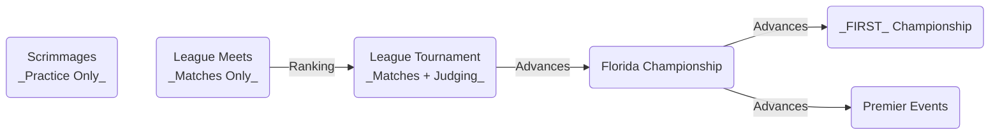

# Overview of the Program

Whether you're new to _FIRST_® or just want to understand how it works in Florida, let's take a look at the program from **big to small**.

## _The Short Version_

- _FIRST_ is a global nonprofit, and _FIRST_ Tech Challenge is one of their programs.
- Florida is a _FIRST_ Tech Challenge **Region**.
- Florida uses a **League** system for advancement between events.
- Most of the regular season happens in a local league, with some teams advancing to post-season events.

## _FIRST_

[For Inspiration and Recognition of Science and Technology (_FIRST_)](https://www.firstinspires.org/about) is a global nonprofit that prepares young people for the future through a suite of welcoming, team-based robotics programs for ages 5-18 (K-12).

||| Purpose
_FIRST_ exists to prepare the young people of today for the world of tomorrow.
||| Vision
To transform our culture by creating a world where science and technology are celebrated and where young people dream of becoming science and technology leaders.
||| Mission
The mission of FIRST is to provide life-changing robotics programs that give young people the skills, confidence, and resilience to build a better world.
|||

To do this, they have three educational robotics programs:

||| _FIRST_® LEGO® League
_FIRST_® LEGO® League offers age-appropriate STEM experiences for kids ages 5-16 through playful robotics and team-based learning. Materials help guide coaches, educators, and students through a series of sessions centered around a yearly theme. The program can be run as a small team or in a classroom-like environment. \*Ages vary by country.

[!button Learn more](https://www.firstinspires.org/programs/fll/)
||| _FIRST_® Tech Challenge
_FIRST_® Tech Challenge participants design and build a classroom-scale robot and compete in a yearly challenge. Along the way, they gain technical skills and work collaboratively to solve problems. Materials include robot build guides, game manuals, and a coach handbook to help guide the experience.

[!button Learn more](https://www.firstinspires.org/programs/ftc/)
||| _FIRST_® Robotics Competition
_FIRST_® Robotics Competition empowers and challenges students to build industrial-sized robots to play in a yearly game. As they work together to create a team identity, build a robot, and advance appreciation for STEM in their community, they learn about career opportunities and leave with lifelong skills. Materials include a standard Kit of Parts, coach and mentor guidance, and robot building and programming documentation.

[!button Learn more](https://www.firstinspires.org/programs/frc/)
|||

We're focused on that middle program: _FIRST_ Tech Challenge.

## _FIRST_ Tech Challenge

Sitting between the LEGO®-based learning experiences of _FIRST_® LEGO® League and the industrial-sized robots of _FIRST_® Robotics Competition, _FIRST_® Tech Challenge provides a yearly challenge using classroom-scale robots.
It is:

- Aligned with common school years (kickoff in September, Championship in April)
- Reasonable to do in a classroom environment (robots up to 18in. cubed)
- Accessible to middle- and high-school students

Despite being smaller in size, _FIRST_ Tech Challenge participants solve real engineering problems using a broad set of materials.
Beyond STEM skills, students can also gain experience with financial planning, marketing, fundraising, and communication.

!!! Registration Fee
_FIRST_ Tech Challenge charges a $325 registration fee for teams each season.
Teams are required to have two registered coaches who consent to background screening each year.
!!!

## Florida _FIRST_ Tech Challenge

_FIRST_ Tech Challenge divides the world into **Regions** for the purpose of competition.
These regions often align with states, provinces, or countries.
In our case, the state of Florida in the United States is a Region.

_FIRST_ works with the [Orlando Robotics Foundation](https://orlrobotics.org), a local nonprofit organization, as the **Program Delivery Organization** for _FIRST_ Tech Challenge in Florida.
Every Program Delivery Organization names an individual **Program Delivery Partner** to serve as the primary point of contact for the program.

||| Program Delivery Partner
**AJ Foster** 
[afoster@firstpartners.org](mailto:afoster@firstpartners.org)
||| Program Delivery Organization
**Orlando Robotics Foundation** 
PO Box 781291, Orlando, FL 32829
|||

If you have any questions about _FIRST_ Tech Challenge in Florida, finding a team, or starting one of your own, start with an email to the Program Delivery Partner.

## Leagues

In Florida, we further divide the region geographically into **Leagues**.
Similar to high school athletics, teams begin the season with local events that include neighboring teams.
As they participate in League Meets, teams accumulate a ranking.
At the league’s capstone League Tournament event, teams play additional matches, enter into playoff rounds, and participate in a judging process for judged awards.
High-performing teams from the League Tournament will advance to the Florida Championship.

Each league is an informal entity led by a volunteer league leadership committee.
They plan events in their area and perform the majority of communication with teams and volunteers throughout the year.
Often, leagues partner with an affiliate nonprofit organization to help manage their finances.

!!! League Fees
Separate from the _FIRST_ Tech Challenge registration fee, leagues charge an annual fee between $150–300.
This covers local event costs (purchasing playing fields, volunteer lunches, and venue fees).
Information about these fees comes from the individual leagues.
!!!

## Season

The _FIRST_ Tech Challenge season begins with a kickoff near the beginning of September and ends with the _FIRST_ Championship event near the end of April.
A typical season looks like this:

- **September**: Kickoff, workshop events, and volunteer training
- **October**: Scrimmage events, which do not contribute to ranking or advancement, but provide valuable practice for teams and volunteers
- **November–January**: League Meets events, where teams play matches and accumulate a league ranking
- **January–February**: League Tournament event, where teams play matches and participate in a judging process to earn advancement to the Florida Championship
- **March**: Florida Championship event
- **April**: [_FIRST_ Championship event](https://www.firstinspires.org/programs/first-championship)
- **April–June**: Premier Events, which are alternative capstone events around the world

Here in Florida, we traditionally host a live kickoff broadcast for all teams, and invite teams to gather in-person where possible.

## What makes it possible

The Florida _FIRST_ Tech Challenge program wouldn't be possible without the help of our incredible volunteers.
Thank you.
